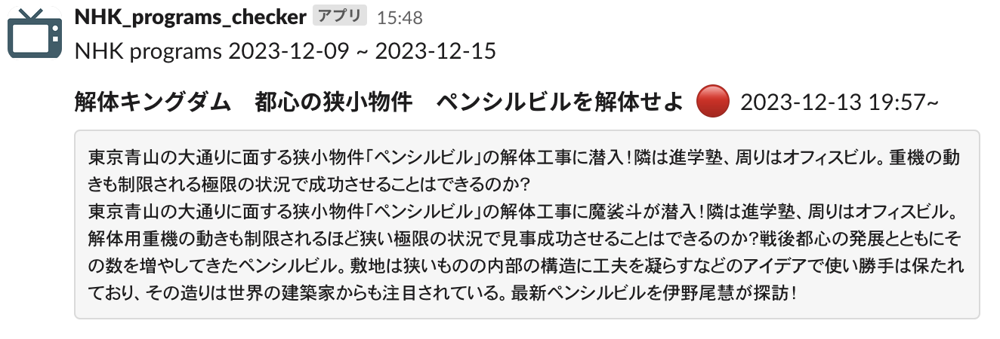

# nhk_programs_checker

条件に合致するNHKの番組情報をチェックして、Slackに通知します.

キーワード「解体」と登録した場合の通知事例  

### Getting Started
#### 1. NHK番組表API でAPIキーを取得する
- https://api-portal.nhk.or.jp で記載内容に従って登録を行い、APIキーを取得します
- 取得したAPIキーは`API_KEY` という名前で環境変数に設定します

#### 2. Slack app を作成する
- https://api.slack.com/start/quickstart を参照して、Slack app を作成します
  - スコープとして `channels:read` が必要です
  - ワークスペースにappをインストールし、投稿するチャンネルにappを追加します
- Bot User OAuth Token を `SLACK_BOT_TOKEN` という名前で、投稿するチャンネルのIDを `CHANNEL_ID` という名前で環境変数に設定します

#### 3. 通知したいキーワード・番組名の設定
- [program_config.yml](program_config.yml) に以下を登録します
  - 通知したい番組名：`program_titles_of_interest` に登録します
  - 通知したいキーワード：`program_contents_of_interest` に登録します
- また、通知したいチャネル（NHK総合・Eテレ等）、対象にしたい地域、チェックしたい期間（最大7日先まで）を [program_config.yml](program_config.yml) で設定することができます.  チャネル・地域については https://api-portal.nhk.or.jp/doc-request に記載があります

#### 4. 実行
- 必要なライブラリのインストール `poetry install`
- 実行 `poetry run python main.py`
